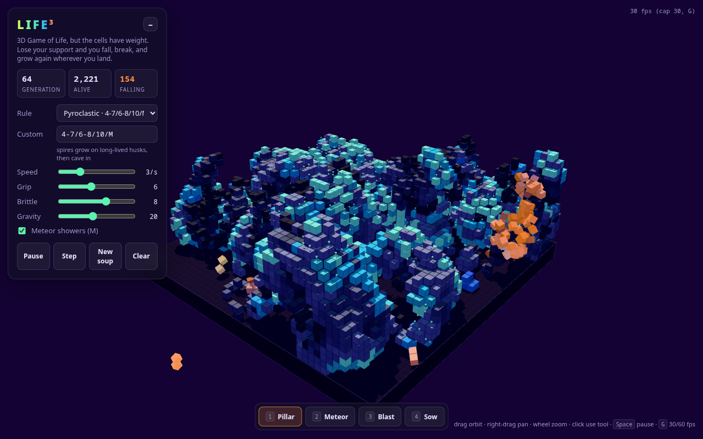

# LIFE³

**3D Game of Life, but the cells have weight.**

[](LICENSE)

**Play it: https://life.petruha.ge**

All done by **Claude Opus 5.5**: the simulation, the physics tuning, the
rendering, the UI and the deployment. Idea and direction by
[@Petyok](https://github.com/Petyok) and a Telegram chat that asked for
"3D Game of Life, like Mike wanted", then added: "and when a column's base
dies, it should fall over, break apart and start interacting with the others".



## How it works

- **Life.** A 48×32×48 lattice runs a 3D cellular automaton with
  Generations-style rules (`survive/birth/states/neighbourhood`). Dying cells
  stay solid for a few generations as husks: they hold structures up until
  they vanish.
- **Support.** Every solid cell needs a path to the ground. Support flows
  from the floor through face and edge neighbours: straight up is free, every
  other step costs one point, so overhangs and hanging parts only reach so far
  (the **Grip** slider).
- **Falling.** Clusters that lose support leave the lattice as
  [Rapier](https://rapier.rs) rigid bodies. A tall column whose base dies
  tips over; a slab drops and lands on whatever grew below.
- **Breaking.** A hard impact shatters a falling chunk into pieces (the
  **Brittle** slider) and knocks lattice cells loose from what it hit.
- **Growing again.** Once a piece comes to rest it snaps back into lattice
  cells and keeps living by the rules. Single cells and anything beyond the
  physics budget drop straight down inside the lattice instead.
- **Meteors** fall now and then and sow a patch of fresh soup where they hit,
  which keeps a world from dying out for good.

## Controls

| Input | Action |
| --- | --- |
| drag / right-drag / wheel | orbit / pan / zoom |
| click | use the current tool |
| `1` `2` `3` `4` | tools: **Pillar** (a tall column that topples), **Meteor**, **Blast**, **Sow** |
| `Space` | pause / resume life (physics keeps running) |
| `N` | step one generation |
| `R` / `C` | new soup / clear |
| `M` | meteor showers on / off |
| `H` | hide the panel |
| `G` | 30 fps cap on / off |

URL parameters: `?rule=pyro|architecture|builder` or a custom rule such as
`?rule=4-6/3/2/M`, and `?seed=N` for a repeatable world.

## Rules

Presets that survive gravity:

| Preset | Rule | Behaviour |
| --- | --- | --- |
| Pyroclastic | `4-7/6-8/10/M` | spires grow on long-lived husks, then cave in (default) |
| Architecture | `4-6/3/2/M` | restless foam, constant rockfall; the heaviest |
| Builder | `2,6,9/4,6,8-9/10/M` | towers shoot up to the ceiling and crash |

Most classic 3D rules do not survive the weight: 445, Clouds and Bays 5766 die
at once, while Amoeba, Coral and Pulse Waves fill the whole box and bury the
physics. Any rule can be typed into the **Custom** field (`M` is the Moore
26-neighbourhood, `VN` von Neumann).

## Performance

It holds 30 fps on a 2015 laptop with Intel HD 6000 graphics. What it took:

- physics at 30 Hz with poses interpolated between steps;
- the lattice collides as 8³ voxel chunks: one lattice-sized Voxels collider
  paired with every falling body and made each step several times slower;
- small debris (up to 4 cubes) does not collide with other small debris;
- an adaptive budget of simultaneous rigid bodies, driven by the measured step
  time, so fast machines get more flying debris and slow ones stay smooth.

## World stats

The card in the top-right corner shows everyone's all-time totals: people
online now, visitors, visits, pillars, meteors, blasts and sows dropped by
visitors, cells born and chunks shattered. Each page reports what happened
since its last report every 15 seconds to a small counter service
([`server/stats.py`](server/stats.py), Python standard library and SQLite)
behind `/api/`.

Privacy: no cookies, and no IP addresses are stored. A visitor is a random id
the page keeps in `localStorage`; "online now" lives only in the server's
memory.

## Run it locally

```sh
npm install
npm run dev        # http://localhost:5173
npm run build      # static site in dist/
```

For the world stats card locally, also run
`STATE_DIRECTORY=/tmp python3 server/stats.py` (Vite proxies `/api` to it).

`node tools/tune.mjs 60 pyro --seed=3` runs the real simulation headless for
60 simulated seconds and prints population, falling cubes and timings; it is
how the presets were picked.

`deploy.sh` and `deploy/` publish the site to its own server (rsync, an nginx
vhost, and the stats service as a systemd unit); adapt them for yours.

## License

[MIT](LICENSE)
